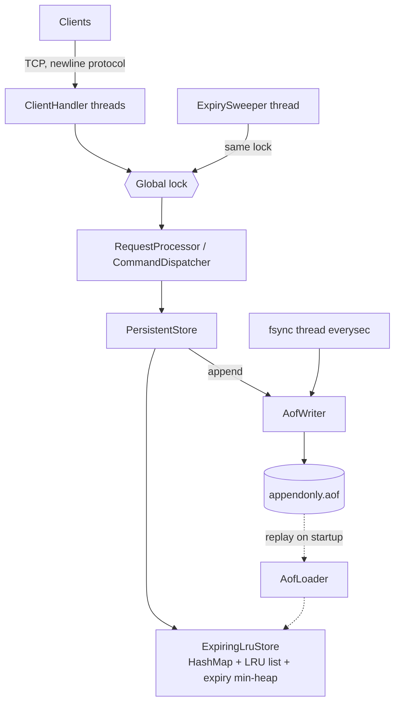

# Redis-lite

A small Java 17 line-protocol key/value server with TTL, active expiration,
LRU limits, and an append-only persistence log.

## Quick start

```sh
mvn clean package
java -jar target/redis-lite-1.0-SNAPSHOT.jar --port 6380
```

```text
SET a 1       -> OK
EXPIRE a 5    -> 1
TTL a         -> 5
```

Connect with `nc localhost 6380`. Commands are `SET key value`, `GET key`,
`DEL key`, `EXISTS key`, `EXPIRE key seconds`, `TTL key`, `DBSIZE`, `PING`, and
`QUIT`. Values may contain spaces.

## Architecture



The store is a hash map of entries, with each entry linked into a sentinel
doubly-linked LRU list. Expiry records are a min-heap; old records are
deliberately retained and ignored when their timestamp no longer matches.
GET/SET/DEL are O(1) average, EXPIRE is O(log n), sweeper work is O(k log n),
and eviction is O(1).

## Configuration

`--port n`, `--repl`, `--max-keys n`, `--no-aof`, `--aof-file path`,
`--aof-fsync always|everysec|no`, and `--sweep-interval-ms n`.

The AOF contains UTF-8 `SET`, `DEL`, and absolute-timestamp `PEXPIREAT` records.
ALWAYS forces each append, EVERYSEC uses a daemon fsync thread, and NO only
forces at close. A torn final line is truncated; complete malformed lines are
fatal. Apply-then-log makes a failed log read-only while preserving reads.

All commands and the sweeper share one global lock; socket I/O is outside it.
The EVERYSEC fsync thread does not take that lock. Wall-clock absolute times
survive restarts, but clock jumps are a known trade-off. Replay disables
eviction and restores the configured limit afterwards, so GET recency is not
recoverable. `DBSIZE` may include expired entries awaiting a sweep.

## Testing and limitations

Run `mvn clean test`. Tests cover protocol/server behavior, expiry, data
structures, persistence, randomized models, and recovery. The AOF grows
forever: there is no rewrite, snapshot, checksum, RESP compatibility, event
loop, or additional data type. The global lock and ALWAYS fsync limit
throughput.
